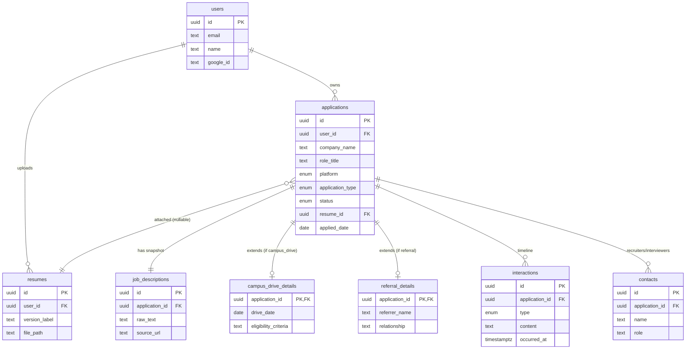

# TrackMyApply — Database Schema (Week 1 Deliverable)

PostgreSQL. Full DDL lives in [`backend/db/schema.sql`](../backend/db/schema.sql).

## Design notes

- **Snapshot, never link**: `job_descriptions.raw_text` stores the full JD text permanently. `source_url` is kept only as a reference, never relied on for retrieval.
- **`applications` is the hub**: every other table hangs off `application_id` (or `user_id`), so "search by company" is a single indexed query (`idx_applications_user_company`).
- **`campus_drive_details` / `referral_details`** are optional 1:1 extensions keyed off `application_type`, instead of a wide `applications` table with mostly-null columns — this is the India-specific differentiator from the roadmap (§5.2).
- **`interactions`** is the source of truth for the Timeline / Narrative view (Phase 5) — every status change, note, or resume attach event is a row here, ordered by `occurred_at`.
- **Salary fields** use `salary_fixed_lpa` / `salary_variable_lpa` / `stipend_monthly` instead of a single US-style range, matching Indian CTC/stipend conventions (§4.1, §5.1).

## ER Diagram

## Status: Pending your approval

This is the Phase 0 "approved schema diagram" deliverable — review and confirm before Phase 1 (CRUD screens) builds against it.
